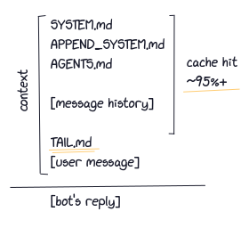

# SALMONFRUIT



SalmonFruit injects `TAIL.md` instructions at the end of message.

---

## Purpose

Bot keeps ignoring their role & rule because system instructions is put early before message history,
so by putting instructions near the end makes the bot read the reminder just before replying, instead of gets diluted by thousands of message history.

## Name

it means nothing.

---

## Installation

```
pi install git:github.com/CatMeowByte/pi_salmonfruit
```

---

## Usage

`TAIL.md` can be placed in the same rule and precedence as `AGENTS.md`.

---

This project is licensed under [WTFPL](http://wtfpl.net "Do What the Fuck You Want to Public License").

This project follows the [HGG](https://catmeowbyte.github.io/heretic_git_guidelines "Heretic Git Guidelines").
